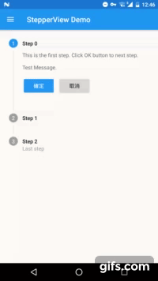

# MaterialStepperView

[](https://jitpack.io/#moe.feng/MaterialStepperView)

[Material Design Stepper](https://material.io/guidelines/components/steppers.html) 控件 Android 版本 (SDK 17+)

[项目 Wiki](https://github.com/fython/MaterialStepperView/wiki)

## 导入 (Gradle)

首先，在你的项目根目录的 build.gradle 加入 JitPack 的 Repositories：

```gradle
allprojects {
	repositories {
		...
		maven { url 'https://jitpack.io' }
	}
}
```

在你的应用模块中加入依赖：

```gradle
dependencies {
    compile 'moe.feng:MaterialStepperView:latest-version'
}
```

## 样式

目前我们只做了竖直样式的 Stepper 组件。

未来将会加入更多的样式。

你可以自定义正常/激活的圆点颜色、完成图标、动画时长、是否启用动画、线条颜色以及错误高亮颜色之类的参数。[How to?](https://github.com/fython/MaterialStepperView/wiki/Set-item-values-and-styles)

### 竖直样式 Stepper

[](https://www.youtube.com/watch?v=y9gSwHKwxVM)

[阅读 Wiki](https://github.com/fython/MaterialStepperView/wiki/Vertical-Style) 了解如何使用。

## 支持

如果你很喜欢这个项目并且乐意支持我，你可以通过支付宝或 PayPal 捐赠我。

支付宝: fythonx@gmail.com

PayPal: [https://www.paypal.me/fython](https://www.paypal.me/fython)

## 协议

```
MIT License

Copyright (c) 2017 Fung Go (fython)

Permission is hereby granted, free of charge, to any person obtaining a copy
of this software and associated documentation files (the "Software"), to deal
in the Software without restriction, including without limitation the rights
to use, copy, modify, merge, publish, distribute, sublicense, and/or sell
copies of the Software, and to permit persons to whom the Software is
furnished to do so, subject to the following conditions:

The above copyright notice and this permission notice shall be included in all
copies or substantial portions of the Software.

THE SOFTWARE IS PROVIDED "AS IS", WITHOUT WARRANTY OF ANY KIND, EXPRESS OR
IMPLIED, INCLUDING BUT NOT LIMITED TO THE WARRANTIES OF MERCHANTABILITY,
FITNESS FOR A PARTICULAR PURPOSE AND NONINFRINGEMENT. IN NO EVENT SHALL THE
AUTHORS OR COPYRIGHT HOLDERS BE LIABLE FOR ANY CLAIM, DAMAGES OR OTHER
LIABILITY, WHETHER IN AN ACTION OF CONTRACT, TORT OR OTHERWISE, ARISING FROM,
OUT OF OR IN CONNECTION WITH THE SOFTWARE OR THE USE OR OTHER DEALINGS IN THE
SOFTWARE.
```
